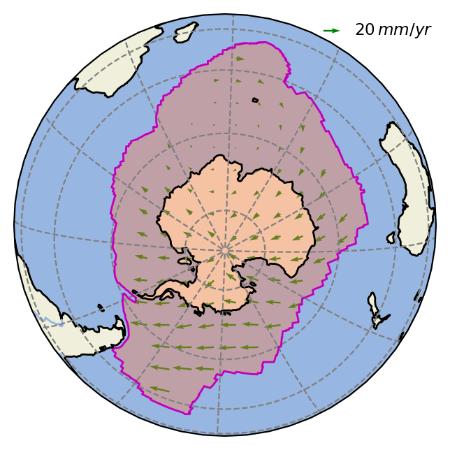

# Welcome to the platemotion package

[](https://pypi.python.org/pypi/platemotion/) [](https://pypi.python.org/pypi/platemotion/) [](https://pypi.python.org/pypi/platemotion/) [](https://GitHub.com/lcx366/PlateTectonic/graphs/contributors/) [](https://GitHub.com/lcx366/PlateTectonic/graphs/commit-activity) [](https://github.com/lcx366/PlateTectonic/blob/master/LICENSE) [](http://PlateTectonic.readthedocs.io/?badge=latest)

The platemotion package is an archive of scientific routines for handling tectonic plate motion. Currently, operations on plate include:

1. Calculate the geometrical and physical properties of plates, such as area, centroid, moment of inertia tensor  
2. Calculate velocities of points given Euler pole parameters
3. Estimate the euler pole based on ITRF2014 velocity field

## How to Install

1. Install **cartopy** from conda by `conda install cartopy`

2. On Linux, macOS and Windows architectures, the binary wheels can be installed using **pip** by executing one of the following commands:

```
pip install platemotion
pip install platemotion --upgrade # to upgrade a pre-existing installation
```

## How to use

### Initialize a plate


```python
from platemotion import Plate
# define a tectonic plate from a spherical polygon file
plate_an = Plate.from_file('platemotion/data/NnrMRVL_PltBndsLatLon/an',skiprows=1) 
```

### Set Euler pole


```python
from astropy import units as u

#omega = np.array([-0.0914,-0.5283,0.7547])*u.mas/u.yr
#plate_an.set_omega(omega,'cartesian')

omega = [59.4*u.deg,236.5*u.deg,0.23*u.deg/u.Ma]
plate_an.set_omega(omega,'spherical')
#plate_an.set_name('Antarctica')
```

Calculate the area of the spherical polygon over the Earth with an averaged radius of 6371km.


```python
from pprint import pprint
pprint(plate_an.info)
```

    {'H_cartesian': <Quantity [-6.27283273e+26, -8.49556792e+26,  5.41130833e+26] kg km2 / Ma>,
     'H_spherical': (<Latitude 27.13117643 deg>,
                     <Longitude 233.55912584 deg>,
                     <Quantity 1.18661435e+27 kg km2 / Ma>),
     'area': <Quantity 58149691.98644825 km2>,
     'centroid': (<Quantity -83.61081032 deg>,
                  <Quantity 57.80052887 deg>,
                  <Quantity 880.96785844 km>),
     'compactness': 0.39900007941415533,
     'density': <Quantity 3.1 g / cm3>,
     'inertia': <Quantity [ 6.77582676e+29,  5.99961382e+29,  1.85826885e+29,
               -2.60236951e+28,  2.67935794e+28,  4.15067565e+28] kg km2>,
     'inertia_mag': <Quantity 9.27275284e+29 kg km2>,
     'inertia_tensor': <Quantity [[ 6.77582676e+29, -2.60236951e+28,  2.67935794e+28],
               [-2.60236951e+28,  5.99961382e+29,  4.15067565e+28],
               [ 2.67935794e+28,  4.15067565e+28,  1.85826885e+29]] kg km2>,
     'omega_cartesian': <Quantity [-0.06462052, -0.09763096,  0.19797067] deg / Ma>,
     'omega_spherical': (<Latitude 59.4 deg>,
                         <Longitude 236.5 deg>,
                         <Quantity 0.23 deg / Ma>),
     'perimeter': <Quantity 40281.70946992 km>,
     'polygon': instance of class Sphericalpolygon,
     'thickness': <Quantity 100. km>}


```python
plate_an.plot()
```

<p align="middle">
  
</p>    


### Calculate velocities of points


```python
location = [-60*u.deg,-90*u.deg,0*u.m]
v = plate_an.velocity_at(location,'geodetic')
pprint(v.info)
```

    {'azimuth': <Quantity 70.63835275 deg>,
     'en': <Quantity [20.41947555,  7.17547259] mm / yr>,
     'speed': <Quantity 21.64352994 mm / yr>,
     'xyz': <Quantity [20.41947555, -6.20366278,  3.60582514] mm / yr>}


```python
locations = [[-45,69]*u.deg,[-67,80]*u.deg,[200,500]*u.m]
v = plate_an.velocity_at(locations,'geodetic')
pprint(v.info)
```

    {'azimuth': <Quantity [ 62.30457157, 105.22683355] deg>,
     'en': <Quantity [[20.67102344, 10.85042608],
               [19.0385182 , -5.1822267 ]] mm / yr>,
     'speed': <Quantity [23.34572673, 19.73121001] mm / yr>,
     'xyz': <Quantity [[ 22.01554216,   1.03807964,   7.6981329 ],
               [-17.90989462,   8.06639686,  -1.86803771]] mm / yr>}


### Plate Motion Model

Currently, only *NNR-MORVEL56* and *GSRMv2.1* are avaliable.

#### NNR-MORVEL56


```python
from platemotion import PlateMotion

nnr_model = PlateMotion.loadmodel('NNR-MORVEL56') # GSRMv2.1
nnr_model_summmary = nnr_model.summary
```

    Loading plates from NNR-MORVEL56: 100%|##########| 56/56 [03:04<00:00,  3.30s/it]


```python
nnr_model_summmary
```


<div>
<style scoped>
    .dataframe tbody tr th:only-of-type {
        vertical-align: middle;
    }

    .dataframe tbody tr th {
        vertical-align: top;
    }
    
    .dataframe thead th {
        text-align: right;
    }
</style>
<table border="1" class="dataframe">
  <thead>
    <tr style="text-align: right;">
      <th></th>
      <th>Plate</th>
      <th>Ab</th>
      <th>ωx</th>
      <th>ωy</th>
      <th>ωz</th>
      <th>Lat.(°N)</th>
      <th>Lon.(°E)</th>
      <th>ω(°/Ma)</th>
      <th>Hx</th>
      <th>Hy</th>
      <th>...</th>
      <th>Q12</th>
      <th>Q13</th>
      <th>Q23</th>
      <th>‖Q‖F(10^27 km^2 kg)</th>
      <th>Area(km^2)</th>
      <th>Perimeter(km)</th>
      <th>Compactness</th>
      <th>Lat.(°N).2</th>
      <th>Lon.(°E).2</th>
      <th>Depth(km)</th>
    </tr>
  </thead>
  <tbody>
    <tr>
      <th>0</th>
      <td>Amur</td>
      <td>am</td>
      <td>-0.073</td>
      <td>-0.113</td>
      <td>0.265</td>
      <td>63.17</td>
      <td>237.18</td>
      <td>0.297</td>
      <td>-13.153</td>
      <td>-229.643</td>
      <td>...</td>
      <td>14.674</td>
      <td>18.550</td>
      <td>-26.198</td>
      <td>93.227</td>
      <td>5.303403e+06</td>
      <td>10623.85</td>
      <td>0.58</td>
      <td>46.14</td>
      <td>125.62</td>
      <td>79.07</td>
    </tr>
    <tr>
      <th>1</th>
      <td>Antarctica</td>
      <td>an</td>
      <td>-0.049</td>
      <td>-0.092</td>
      <td>0.227</td>
      <td>65.42</td>
      <td>241.89</td>
      <td>0.250</td>
      <td>-431.464</td>
      <td>-773.526</td>
      <td>...</td>
      <td>-26.024</td>
      <td>26.794</td>
      <td>41.507</td>
      <td>927.275</td>
      <td>5.814969e+07</td>
      <td>40281.71</td>
      <td>0.40</td>
      <td>-83.61</td>
      <td>57.80</td>
      <td>880.97</td>
    </tr>
    <tr>
      <th>2</th>
      <td>Arabia</td>
      <td>ar</td>
      <td>0.364</td>
      <td>-0.054</td>
      <td>0.421</td>
      <td>48.88</td>
      <td>351.51</td>
      <td>0.559</td>
      <td>153.309</td>
      <td>-306.945</td>
      <td>...</td>
      <td>-24.914</td>
      <td>-15.093</td>
      <td>-15.853</td>
      <td>86.263</td>
      <td>4.904200e+06</td>
      <td>10634.77</td>
      <td>0.54</td>
      <td>23.68</td>
      <td>47.06</td>
      <td>75.05</td>
    </tr>
    <tr>
      <th>3</th>
      <td>Australia</td>
      <td>au</td>
      <td>0.414</td>
      <td>0.323</td>
      <td>0.352</td>
      <td>33.86</td>
      <td>37.94</td>
      <td>0.632</td>
      <td>2167.411</td>
      <td>3190.055</td>
      <td>...</td>
      <td>114.401</td>
      <td>-110.930</td>
      <td>123.123</td>
      <td>615.306</td>
      <td>3.739861e+07</td>
      <td>29918.84</td>
      <td>0.49</td>
      <td>-31.50</td>
      <td>132.34</td>
      <td>577.37</td>
    </tr>
    <tr>
      <th>4</th>
      <td>Capricorn</td>
      <td>cp</td>
      <td>0.399</td>
      <td>0.170</td>
      <td>0.426</td>
      <td>44.44</td>
      <td>23.09</td>
      <td>0.608</td>
      <td>694.008</td>
      <td>129.685</td>
      <td>...</td>
      <td>-11.050</td>
      <td>3.668</td>
      <td>23.291</td>
      <td>144.348</td>
      <td>8.265942e+06</td>
      <td>13287.27</td>
      <td>0.58</td>
      <td>-14.30</td>
      <td>82.93</td>
      <td>123.16</td>
    </tr>
    <tr>
      <th>5</th>
      <td>Caribbean</td>
      <td>ca</td>
      <td>-0.011</td>
      <td>-0.233</td>
      <td>0.165</td>
      <td>35.20</td>
      <td>267.38</td>
      <td>0.286</td>
      <td>-51.417</td>
      <td>-1.557</td>
      <td>...</td>
      <td>9.196</td>
      <td>-2.662</td>
      <td>8.713</td>
      <td>52.144</td>
      <td>2.964782e+06</td>
      <td>8998.46</td>
      <td>0.46</td>
      <td>15.03</td>
      <td>286.85</td>
      <td>76.10</td>
    </tr>
    <tr>
      <th>6</th>
      <td>Cocos</td>
      <td>co</td>
      <td>-0.602</td>
      <td>-0.882</td>
      <td>0.543</td>
      <td>26.93</td>
      <td>235.69</td>
      <td>1.198</td>
      <td>-332.681</td>
      <td>55.068</td>
      <td>...</td>
      <td>-2.831</td>
      <td>0.543</td>
      <td>5.180</td>
      <td>51.788</td>
      <td>2.931807e+06</td>
      <td>8083.46</td>
      <td>0.56</td>
      <td>8.37</td>
      <td>265.35</td>
      <td>47.43</td>
    </tr>
    <tr>
      <th>7</th>
      <td>Eurasia</td>
      <td>eu</td>
      <td>-0.042</td>
      <td>-0.141</td>
      <td>0.168</td>
      <td>48.85</td>
      <td>253.50</td>
      <td>0.223</td>
      <td>-648.252</td>
      <td>-1573.417</td>
      <td>...</td>
      <td>-18.161</td>
      <td>-108.899</td>
      <td>-158.461</td>
      <td>781.347</td>
      <td>4.855785e+07</td>
      <td>41567.75</td>
      <td>0.32</td>
      <td>59.05</td>
      <td>58.30</td>
      <td>789.50</td>
    </tr>
    <tr>
      <th>8</th>
      <td>India</td>
      <td>in</td>
      <td>0.346</td>
      <td>-0.020</td>
      <td>0.419</td>
      <td>50.37</td>
      <td>356.71</td>
      <td>0.544</td>
      <td>845.422</td>
      <td>-409.581</td>
      <td>...</td>
      <td>-29.136</td>
      <td>-6.688</td>
      <td>-30.894</td>
      <td>215.867</td>
      <td>1.243504e+07</td>
      <td>17113.95</td>
      <td>0.52</td>
      <td>12.98</td>
      <td>77.49</td>
      <td>162.86</td>
    </tr>
    <tr>
      <th>9</th>
      <td>Juan de Fuca</td>
      <td>jf</td>
      <td>0.373</td>
      <td>0.647</td>
      <td>-0.590</td>
      <td>-38.31</td>
      <td>60.04</td>
      <td>0.951</td>
      <td>-1.570</td>
      <td>7.031</td>
      <td>...</td>
      <td>-0.767</td>
      <td>0.978</td>
      <td>1.272</td>
      <td>4.556</td>
      <td>2.563227e+05</td>
      <td>3312.65</td>
      <td>0.29</td>
      <td>45.43</td>
      <td>232.47</td>
      <td>7.96</td>
    </tr>
    <tr>
      <th>10</th>
      <td>Lwandle</td>
      <td>lw</td>
      <td>0.062</td>
      <td>-0.165</td>
      <td>0.225</td>
      <td>51.89</td>
      <td>290.48</td>
      <td>0.286</td>
      <td>170.963</td>
      <td>-83.923</td>
      <td>...</td>
      <td>-22.135</td>
      <td>18.412</td>
      <td>15.150</td>
      <td>83.574</td>
      <td>4.753637e+06</td>
      <td>11706.88</td>
      <td>0.43</td>
      <td>-28.19</td>
      <td>39.21</td>
      <td>78.38</td>
    </tr>
    <tr>
      <th>11</th>
      <td>Macquarie</td>
      <td>mq</td>
      <td>0.734</td>
      <td>0.143</td>
      <td>0.866</td>
      <td>49.19</td>
      <td>11.05</td>
      <td>1.144</td>
      <td>16.662</td>
      <td>26.215</td>
      <td>...</td>
      <td>0.415</td>
      <td>-1.620</td>
      <td>0.748</td>
      <td>5.694</td>
      <td>3.202684e+05</td>
      <td>2816.44</td>
      <td>0.51</td>
      <td>-58.68</td>
      <td>155.19</td>
      <td>5.42</td>
    </tr>
    <tr>
      <th>12</th>
      <td>Nazca</td>
      <td>nz</td>
      <td>-0.092</td>
      <td>-0.473</td>
      <td>0.503</td>
      <td>46.23</td>
      <td>258.94</td>
      <td>0.696</td>
      <td>-277.314</td>
      <td>-785.905</td>
      <td>...</td>
      <td>-6.458</td>
      <td>-1.516</td>
      <td>-57.931</td>
      <td>277.199</td>
      <td>1.610124e+07</td>
      <td>20148.02</td>
      <td>0.48</td>
      <td>-19.92</td>
      <td>267.84</td>
      <td>220.52</td>
    </tr>
    <tr>
      <th>13</th>
      <td>North America</td>
      <td>na</td>
      <td>0.034</td>
      <td>-0.205</td>
      <td>-0.018</td>
      <td>-4.85</td>
      <td>279.36</td>
      <td>0.209</td>
      <td>250.269</td>
      <td>-1767.046</td>
      <td>...</td>
      <td>33.802</td>
      <td>-1.855</td>
      <td>202.376</td>
      <td>889.564</td>
      <td>5.543143e+07</td>
      <td>34361.85</td>
      <td>0.53</td>
      <td>57.92</td>
      <td>273.92</td>
      <td>798.28</td>
    </tr>
    <tr>
      <th>14</th>
      <td>Nubia</td>
      <td>nb</td>
      <td>0.072</td>
      <td>-0.183</td>
      <td>0.216</td>
      <td>47.68</td>
      <td>291.56</td>
      <td>0.292</td>
      <td>-5.864</td>
      <td>-8.229</td>
      <td>...</td>
      <td>2.150</td>
      <td>-0.184</td>
      <td>0.108</td>
      <td>6.893</td>
      <td>3.881402e+05</td>
      <td>3835.33</td>
      <td>0.33</td>
      <td>-2.52</td>
      <td>148.63</td>
      <td>13.03</td>
    </tr>
    <tr>
      <th>15</th>
      <td>Pacific</td>
      <td>pa</td>
      <td>-0.121</td>
      <td>0.263</td>
      <td>-0.583</td>
      <td>-63.58</td>
      <td>114.70</td>
      <td>0.651</td>
      <td>-2678.327</td>
      <td>5362.521</td>
      <td>...</td>
      <td>-219.343</td>
      <td>39.545</td>
      <td>-29.332</td>
      <td>1589.318</td>
      <td>1.045938e+08</td>
      <td>48335.51</td>
      <td>0.45</td>
      <td>1.57</td>
      <td>202.75</td>
      <td>1452.00</td>
    </tr>
    <tr>
      <th>16</th>
      <td>Philippine Sea</td>
      <td>ps</td>
      <td>0.540</td>
      <td>-0.329</td>
      <td>-0.655</td>
      <td>-46.02</td>
      <td>328.64</td>
      <td>0.910</td>
      <td>47.495</td>
      <td>232.842</td>
      <td>...</td>
      <td>29.776</td>
      <td>13.610</td>
      <td>-14.116</td>
      <td>95.663</td>
      <td>5.443797e+06</td>
      <td>11279.45</td>
      <td>0.53</td>
      <td>18.34</td>
      <td>133.46</td>
      <td>81.35</td>
    </tr>
    <tr>
      <th>17</th>
      <td>Rivera</td>
      <td>ri</td>
      <td>-1.265</td>
      <td>-4.063</td>
      <td>1.570</td>
      <td>20.25</td>
      <td>252.71</td>
      <td>4.536</td>
      <td>0.189</td>
      <td>0.019</td>
      <td>...</td>
      <td>-0.319</td>
      <td>0.122</td>
      <td>0.390</td>
      <td>1.795</td>
      <td>1.008984e+05</td>
      <td>1481.84</td>
      <td>0.58</td>
      <td>20.04</td>
      <td>252.60</td>
      <td>1.67</td>
    </tr>
    <tr>
      <th>18</th>
      <td>Sandwich</td>
      <td>SW</td>
      <td>0.944</td>
      <td>-0.708</td>
      <td>-0.680</td>
      <td>-29.94</td>
      <td>323.13</td>
      <td>1.362</td>
      <td>15.337</td>
      <td>-16.817</td>
      <td>...</td>
      <td>0.269</td>
      <td>0.928</td>
      <td>-0.480</td>
      <td>3.280</td>
      <td>1.844105e+05</td>
      <td>1822.73</td>
      <td>0.70</td>
      <td>-57.80</td>
      <td>332.63</td>
      <td>2.73</td>
    </tr>
    <tr>
      <th>19</th>
      <td>Scotia</td>
      <td>SC</td>
      <td>-0.038</td>
      <td>-0.130</td>
      <td>0.056</td>
      <td>22.52</td>
      <td>253.85</td>
      <td>0.146</td>
      <td>-12.880</td>
      <td>-48.905</td>
      <td>...</td>
      <td>2.908</td>
      <td>6.123</td>
      <td>-7.381</td>
      <td>30.066</td>
      <td>1.700716e+06</td>
      <td>7724.24</td>
      <td>0.36</td>
      <td>-57.29</td>
      <td>309.58</td>
      <td>42.37</td>
    </tr>
    <tr>
      <th>20</th>
      <td>Somalia</td>
      <td>sm</td>
      <td>0.021</td>
      <td>-0.217</td>
      <td>0.259</td>
      <td>49.95</td>
      <td>275.48</td>
      <td>0.339</td>
      <td>398.115</td>
      <td>-243.385</td>
      <td>...</td>
      <td>-79.112</td>
      <td>12.643</td>
      <td>18.315</td>
      <td>248.311</td>
      <td>1.440102e+07</td>
      <td>19256.05</td>
      <td>0.47</td>
      <td>-7.98</td>
      <td>51.20</td>
      <td>210.07</td>
    </tr>
    <tr>
      <th>21</th>
      <td>South America</td>
      <td>sa</td>
      <td>-0.039</td>
      <td>-0.093</td>
      <td>-0.042</td>
      <td>-22.62</td>
      <td>247.17</td>
      <td>0.109</td>
      <td>-557.774</td>
      <td>-536.392</td>
      <td>...</td>
      <td>172.790</td>
      <td>91.516</td>
      <td>-86.113</td>
      <td>670.920</td>
      <td>4.072691e+07</td>
      <td>33048.47</td>
      <td>0.43</td>
      <td>-20.60</td>
      <td>314.20</td>
      <td>553.87</td>
    </tr>
    <tr>
      <th>22</th>
      <td>Sunda</td>
      <td>su</td>
      <td>-0.019</td>
      <td>-0.216</td>
      <td>0.258</td>
      <td>50.06</td>
      <td>264.98</td>
      <td>0.337</td>
      <td>-149.553</td>
      <td>-120.216</td>
      <td>...</td>
      <td>35.293</td>
      <td>3.342</td>
      <td>-8.597</td>
      <td>155.795</td>
      <td>8.916227e+06</td>
      <td>14027.20</td>
      <td>0.56</td>
      <td>5.01</td>
      <td>111.10</td>
      <td>118.89</td>
    </tr>
    <tr>
      <th>23</th>
      <td>Sur</td>
      <td>sr</td>
      <td>-0.033</td>
      <td>-0.084</td>
      <td>-0.057</td>
      <td>-32.50</td>
      <td>248.68</td>
      <td>0.107</td>
      <td>-13.203</td>
      <td>-18.912</td>
      <td>...</td>
      <td>0.998</td>
      <td>6.254</td>
      <td>-1.510</td>
      <td>19.487</td>
      <td>1.098150e+06</td>
      <td>5189.20</td>
      <td>0.51</td>
      <td>-55.12</td>
      <td>346.52</td>
      <td>17.86</td>
    </tr>
    <tr>
      <th>24</th>
      <td>Yangtze</td>
      <td>yz</td>
      <td>-0.068</td>
      <td>-0.135</td>
      <td>0.298</td>
      <td>63.03</td>
      <td>243.38</td>
      <td>0.334</td>
      <td>-22.130</td>
      <td>-85.981</td>
      <td>...</td>
      <td>8.500</td>
      <td>4.928</td>
      <td>-9.974</td>
      <td>38.979</td>
      <td>2.201941e+06</td>
      <td>7134.39</td>
      <td>0.54</td>
      <td>27.26</td>
      <td>116.18</td>
      <td>33.46</td>
    </tr>
    <tr>
      <th>25</th>
      <td>Aegean Sea</td>
      <td>AS</td>
      <td>-0.063</td>
      <td>0.098</td>
      <td>0.041</td>
      <td>19.43</td>
      <td>122.87</td>
      <td>0.124</td>
      <td>-5.102</td>
      <td>6.648</td>
      <td>...</td>
      <td>-0.990</td>
      <td>-1.760</td>
      <td>-0.822</td>
      <td>5.724</td>
      <td>3.218650e+05</td>
      <td>2356.17</td>
      <td>0.73</td>
      <td>36.97</td>
      <td>25.06</td>
      <td>4.38</td>
    </tr>
    <tr>
      <th>26</th>
      <td>Altiplano</td>
      <td>AP</td>
      <td>0.051</td>
      <td>-0.482</td>
      <td>-0.056</td>
      <td>-6.58</td>
      <td>276.02</td>
      <td>0.488</td>
      <td>-18.993</td>
      <td>-12.488</td>
      <td>...</td>
      <td>3.114</td>
      <td>1.050</td>
      <td>-2.768</td>
      <td>14.777</td>
      <td>8.321276e+05</td>
      <td>3858.38</td>
      <td>0.70</td>
      <td>-17.34</td>
      <td>290.56</td>
      <td>13.05</td>
    </tr>
    <tr>
      <th>27</th>
      <td>Anatolia</td>
      <td>AT</td>
      <td>0.827</td>
      <td>0.415</td>
      <td>0.780</td>
      <td>40.11</td>
      <td>26.66</td>
      <td>1.210</td>
      <td>4.371</td>
      <td>-12.327</td>
      <td>...</td>
      <td>-2.028</td>
      <td>-2.945</td>
      <td>-1.907</td>
      <td>10.229</td>
      <td>5.756255e+05</td>
      <td>3345.52</td>
      <td>0.65</td>
      <td>38.24</td>
      <td>32.92</td>
      <td>8.66</td>
    </tr>
    <tr>
      <th>28</th>
      <td>Balmoral Reef</td>
      <td>BR</td>
      <td>-0.171</td>
      <td>0.133</td>
      <td>-0.439</td>
      <td>-63.74</td>
      <td>142.06</td>
      <td>0.490</td>
      <td>4.558</td>
      <td>4.858</td>
      <td>...</td>
      <td>0.164</td>
      <td>-0.615</td>
      <td>0.044</td>
      <td>3.475</td>
      <td>1.953799e+05</td>
      <td>2131.61</td>
      <td>0.54</td>
      <td>-15.06</td>
      <td>175.87</td>
      <td>3.28</td>
    </tr>
    <tr>
      <th>29</th>
      <td>Banda Sea</td>
      <td>BS</td>
      <td>-1.298</td>
      <td>2.106</td>
      <td>-0.064</td>
      <td>-1.49</td>
      <td>121.64</td>
      <td>2.475</td>
      <td>19.274</td>
      <td>18.959</td>
      <td>...</td>
      <td>4.074</td>
      <td>-0.434</td>
      <td>0.599</td>
      <td>12.347</td>
      <td>6.959325e+05</td>
      <td>4968.34</td>
      <td>0.35</td>
      <td>-4.90</td>
      <td>125.71</td>
      <td>18.99</td>
    </tr>
    <tr>
      <th>30</th>
      <td>Birds Head</td>
      <td>BH</td>
      <td>-0.112</td>
      <td>0.602</td>
      <td>-0.514</td>
      <td>-40.00</td>
      <td>100.50</td>
      <td>0.799</td>
      <td>28.056</td>
      <td>23.877</td>
      <td>...</td>
      <td>3.264</td>
      <td>-0.099</td>
      <td>0.103</td>
      <td>9.336</td>
      <td>5.256390e+05</td>
      <td>3577.94</td>
      <td>0.52</td>
      <td>-1.24</td>
      <td>131.99</td>
      <td>12.28</td>
    </tr>
    <tr>
      <th>31</th>
      <td>Burma</td>
      <td>BU</td>
      <td>0.457</td>
      <td>-2.169</td>
      <td>-0.238</td>
      <td>-6.13</td>
      <td>281.90</td>
      <td>2.229</td>
      <td>34.713</td>
      <td>-0.845</td>
      <td>...</td>
      <td>0.435</td>
      <td>0.066</td>
      <td>-0.989</td>
      <td>9.146</td>
      <td>5.153850e+05</td>
      <td>4033.03</td>
      <td>0.40</td>
      <td>9.00</td>
      <td>93.98</td>
      <td>17.43</td>
    </tr>
    <tr>
      <th>32</th>
      <td>Caroline</td>
      <td>CL</td>
      <td>0.055</td>
      <td>0.171</td>
      <td>-0.580</td>
      <td>-72.78</td>
      <td>72.05</td>
      <td>0.607</td>
      <td>27.128</td>
      <td>50.084</td>
      <td>...</td>
      <td>9.291</td>
      <td>0.807</td>
      <td>-0.676</td>
      <td>27.099</td>
      <td>1.528196e+06</td>
      <td>5301.21</td>
      <td>0.68</td>
      <td>3.17</td>
      <td>140.55</td>
      <td>22.45</td>
    </tr>
    <tr>
      <th>33</th>
      <td>Conway Reef</td>
      <td>CR</td>
      <td>-3.627</td>
      <td>0.605</td>
      <td>-1.367</td>
      <td>-20.40</td>
      <td>170.53</td>
      <td>3.923</td>
      <td>1.573</td>
      <td>8.483</td>
      <td>...</td>
      <td>0.147</td>
      <td>-0.562</td>
      <td>0.052</td>
      <td>2.570</td>
      <td>1.444575e+05</td>
      <td>1859.82</td>
      <td>0.52</td>
      <td>-19.21</td>
      <td>174.75</td>
      <td>2.55</td>
    </tr>
    <tr>
      <th>34</th>
      <td>Easter</td>
      <td>EA</td>
      <td>3.927</td>
      <td>9.495</td>
      <td>4.785</td>
      <td>24.97</td>
      <td>67.53</td>
      <td>11.334</td>
      <td>-9.163</td>
      <td>3.009</td>
      <td>...</td>
      <td>-0.644</td>
      <td>-0.322</td>
      <td>-0.725</td>
      <td>2.970</td>
      <td>1.669842e+05</td>
      <td>1783.03</td>
      <td>0.66</td>
      <td>-24.57</td>
      <td>246.07</td>
      <td>2.25</td>
    </tr>
    <tr>
      <th>35</th>
      <td>Futuna</td>
      <td>FT</td>
      <td>-4.892</td>
      <td>0.165</td>
      <td>-1.434</td>
      <td>-16.33</td>
      <td>178.07</td>
      <td>5.101</td>
      <td>0.127</td>
      <td>2.444</td>
      <td>...</td>
      <td>-0.014</td>
      <td>-0.100</td>
      <td>-0.004</td>
      <td>0.570</td>
      <td>3.201157e+04</td>
      <td>919.36</td>
      <td>0.48</td>
      <td>-14.97</td>
      <td>182.13</td>
      <td>0.74</td>
    </tr>
    <tr>
      <th>36</th>
      <td>Galapagos</td>
      <td>GP</td>
      <td>0.841</td>
      <td>5.417</td>
      <td>0.242</td>
      <td>2.53</td>
      <td>81.18</td>
      <td>5.487</td>
      <td>-0.852</td>
      <td>0.222</td>
      <td>...</td>
      <td>-0.036</td>
      <td>0.001</td>
      <td>0.006</td>
      <td>0.260</td>
      <td>1.462437e+04</td>
      <td>576.37</td>
      <td>0.55</td>
      <td>1.87</td>
      <td>258.32</td>
      <td>0.22</td>
    </tr>
    <tr>
      <th>37</th>
      <td>Juan Fernandez</td>
      <td>JZ</td>
      <td>6.099</td>
      <td>17.454</td>
      <td>12.589</td>
      <td>34.25</td>
      <td>70.74</td>
      <td>22.368</td>
      <td>-12.130</td>
      <td>0.294</td>
      <td>...</td>
      <td>-0.286</td>
      <td>-0.201</td>
      <td>-0.527</td>
      <td>1.738</td>
      <td>9.767412e+04</td>
      <td>1239.13</td>
      <td>0.80</td>
      <td>-33.34</td>
      <td>249.09</td>
      <td>1.27</td>
    </tr>
    <tr>
      <th>38</th>
      <td>Kermadec</td>
      <td>KE</td>
      <td>1.787</td>
      <td>0.202</td>
      <td>1.508</td>
      <td>39.99</td>
      <td>6.46</td>
      <td>2.347</td>
      <td>-15.633</td>
      <td>20.010</td>
      <td>...</td>
      <td>-0.063</td>
      <td>-2.855</td>
      <td>-0.017</td>
      <td>8.951</td>
      <td>5.053495e+05</td>
      <td>4775.62</td>
      <td>0.28</td>
      <td>-33.02</td>
      <td>180.67</td>
      <td>29.97</td>
    </tr>
    <tr>
      <th>39</th>
      <td>Manus</td>
      <td>MN</td>
      <td>-44.689</td>
      <td>25.521</td>
      <td>-3.301</td>
      <td>-3.67</td>
      <td>150.27</td>
      <td>51.569</td>
      <td>0.192</td>
      <td>0.318</td>
      <td>...</td>
      <td>0.044</td>
      <td>-0.006</td>
      <td>0.003</td>
      <td>0.146</td>
      <td>8.220170e+03</td>
      <td>413.71</td>
      <td>0.60</td>
      <td>-3.53</td>
      <td>150.50</td>
      <td>0.13</td>
    </tr>
    <tr>
      <th>40</th>
      <td>Maoke</td>
      <td>MO</td>
      <td>-0.035</td>
      <td>0.749</td>
      <td>0.191</td>
      <td>14.25</td>
      <td>92.67</td>
      <td>0.774</td>
      <td>8.776</td>
      <td>10.312</td>
      <td>...</td>
      <td>0.718</td>
      <td>-0.064</td>
      <td>0.058</td>
      <td>2.051</td>
      <td>1.153029e+05</td>
      <td>1647.84</td>
      <td>0.53</td>
      <td>-3.42</td>
      <td>138.15</td>
      <td>2.07</td>
    </tr>
    <tr>
      <th>41</th>
      <td>Mariana</td>
      <td>MA</td>
      <td>-0.950</td>
      <td>0.860</td>
      <td>0.250</td>
      <td>11.05</td>
      <td>137.84</td>
      <td>1.306</td>
      <td>5.003</td>
      <td>15.579</td>
      <td>...</td>
      <td>2.232</td>
      <td>1.264</td>
      <td>-0.872</td>
      <td>7.474</td>
      <td>4.207784e+05</td>
      <td>3548.51</td>
      <td>0.42</td>
      <td>17.88</td>
      <td>145.44</td>
      <td>11.97</td>
    </tr>
    <tr>
      <th>42</th>
      <td>Molucca Sea</td>
      <td>MS</td>
      <td>1.988</td>
      <td>-2.957</td>
      <td>0.134</td>
      <td>2.15</td>
      <td>303.91</td>
      <td>3.566</td>
      <td>2.414</td>
      <td>0.796</td>
      <td>...</td>
      <td>2.410</td>
      <td>-0.060</td>
      <td>0.084</td>
      <td>7.431</td>
      <td>4.181131e+05</td>
      <td>3268.02</td>
      <td>0.49</td>
      <td>-1.13</td>
      <td>123.48</td>
      <td>7.63</td>
    </tr>
    <tr>
      <th>43</th>
      <td>New Hebrides</td>
      <td>NH</td>
      <td>2.453</td>
      <td>-0.284</td>
      <td>0.025</td>
      <td>0.57</td>
      <td>353.40</td>
      <td>2.469</td>
      <td>35.290</td>
      <td>12.374</td>
      <td>...</td>
      <td>1.198</td>
      <td>-2.322</td>
      <td>0.387</td>
      <td>11.433</td>
      <td>6.434675e+05</td>
      <td>3514.29</td>
      <td>0.65</td>
      <td>-17.88</td>
      <td>170.44</td>
      <td>9.71</td>
    </tr>
    <tr>
      <th>44</th>
      <td>Niuafo'ou</td>
      <td>NI</td>
      <td>-3.293</td>
      <td>-0.318</td>
      <td>-0.190</td>
      <td>-3.29</td>
      <td>185.51</td>
      <td>3.314</td>
      <td>-5.920</td>
      <td>-2.304</td>
      <td>...</td>
      <td>-0.108</td>
      <td>-0.428</td>
      <td>-0.032</td>
      <td>2.211</td>
      <td>1.242883e+05</td>
      <td>1768.19</td>
      <td>0.50</td>
      <td>-16.69</td>
      <td>184.34</td>
      <td>2.28</td>
    </tr>
    <tr>
      <th>45</th>
      <td>North Andes</td>
      <td>ND</td>
      <td>-0.060</td>
      <td>-0.093</td>
      <td>0.035</td>
      <td>17.73</td>
      <td>237.32</td>
      <td>0.116</td>
      <td>-16.894</td>
      <td>-3.936</td>
      <td>...</td>
      <td>2.939</td>
      <td>-0.376</td>
      <td>1.269</td>
      <td>17.222</td>
      <td>9.718156e+05</td>
      <td>5368.42</td>
      <td>0.42</td>
      <td>6.33</td>
      <td>284.76</td>
      <td>26.51</td>
    </tr>
    <tr>
      <th>46</th>
      <td>North Bismarck</td>
      <td>NB</td>
      <td>-0.369</td>
      <td>0.479</td>
      <td>-0.606</td>
      <td>-45.04</td>
      <td>127.64</td>
      <td>0.856</td>
      <td>11.278</td>
      <td>14.723</td>
      <td>...</td>
      <td>2.150</td>
      <td>-0.184</td>
      <td>0.108</td>
      <td>6.893</td>
      <td>3.881402e+05</td>
      <td>3835.33</td>
      <td>0.33</td>
      <td>-2.52</td>
      <td>148.63</td>
      <td>13.03</td>
    </tr>
    <tr>
      <th>47</th>
      <td>Okhotsk</td>
      <td>OK</td>
      <td>-0.008</td>
      <td>-0.198</td>
      <td>0.116</td>
      <td>30.30</td>
      <td>267.72</td>
      <td>0.229</td>
      <td>4.668</td>
      <td>-136.269</td>
      <td>...</td>
      <td>6.616</td>
      <td>15.485</td>
      <td>-9.127</td>
      <td>53.486</td>
      <td>3.037119e+06</td>
      <td>9459.60</td>
      <td>0.42</td>
      <td>51.24</td>
      <td>148.99</td>
      <td>67.44</td>
    </tr>
    <tr>
      <th>48</th>
      <td>Okinawa</td>
      <td>ON</td>
      <td>-1.522</td>
      <td>1.374</td>
      <td>1.497</td>
      <td>36.12</td>
      <td>137.92</td>
      <td>2.539</td>
      <td>-12.180</td>
      <td>-25.417</td>
      <td>...</td>
      <td>1.555</td>
      <td>1.024</td>
      <td>-1.303</td>
      <td>5.768</td>
      <td>3.247068e+05</td>
      <td>3384.93</td>
      <td>0.36</td>
      <td>27.33</td>
      <td>127.95</td>
      <td>11.58</td>
    </tr>
    <tr>
      <th>49</th>
      <td>Panama</td>
      <td>PM</td>
      <td>-0.110</td>
      <td>-0.248</td>
      <td>0.165</td>
      <td>31.35</td>
      <td>246.10</td>
      <td>0.317</td>
      <td>-8.867</td>
      <td>-0.210</td>
      <td>...</td>
      <td>0.511</td>
      <td>-0.081</td>
      <td>0.521</td>
      <td>4.866</td>
      <td>2.737256e+05</td>
      <td>2593.99</td>
      <td>0.51</td>
      <td>8.94</td>
      <td>278.88</td>
      <td>6.54</td>
    </tr>
    <tr>
      <th>50</th>
      <td>Shetland</td>
      <td>SL</td>
      <td>-0.136</td>
      <td>-0.101</td>
      <td>0.207</td>
      <td>50.71</td>
      <td>216.53</td>
      <td>0.268</td>
      <td>-1.489</td>
      <td>-2.725</td>
      <td>...</td>
      <td>0.089</td>
      <td>0.194</td>
      <td>-0.324</td>
      <td>1.286</td>
      <td>7.226161e+04</td>
      <td>1235.12</td>
      <td>0.60</td>
      <td>-61.90</td>
      <td>301.00</td>
      <td>1.57</td>
    </tr>
    <tr>
      <th>51</th>
      <td>Solomon Sea</td>
      <td>SS</td>
      <td>-1.107</td>
      <td>1.291</td>
      <td>-0.085</td>
      <td>-2.87</td>
      <td>130.62</td>
      <td>1.703</td>
      <td>7.874</td>
      <td>16.113</td>
      <td>...</td>
      <td>0.651</td>
      <td>-0.180</td>
      <td>0.093</td>
      <td>2.289</td>
      <td>1.286602e+05</td>
      <td>1775.52</td>
      <td>0.51</td>
      <td>-7.26</td>
      <td>152.54</td>
      <td>2.43</td>
    </tr>
    <tr>
      <th>52</th>
      <td>South Bismarck</td>
      <td>SB</td>
      <td>6.837</td>
      <td>-4.254</td>
      <td>0.972</td>
      <td>6.88</td>
      <td>328.11</td>
      <td>8.111</td>
      <td>-3.581</td>
      <td>-4.769</td>
      <td>...</td>
      <td>1.707</td>
      <td>-0.292</td>
      <td>0.177</td>
      <td>5.495</td>
      <td>3.090909e+05</td>
      <td>2784.42</td>
      <td>0.50</td>
      <td>-5.06</td>
      <td>148.73</td>
      <td>5.57</td>
    </tr>
    <tr>
      <th>53</th>
      <td>Timor</td>
      <td>TI</td>
      <td>-0.741</td>
      <td>1.704</td>
      <td>-0.144</td>
      <td>-4.44</td>
      <td>113.50</td>
      <td>1.864</td>
      <td>23.658</td>
      <td>19.560</td>
      <td>...</td>
      <td>2.047</td>
      <td>-0.383</td>
      <td>0.537</td>
      <td>6.276</td>
      <td>3.532757e+05</td>
      <td>3246.87</td>
      <td>0.42</td>
      <td>-8.67</td>
      <td>125.80</td>
      <td>11.15</td>
    </tr>
    <tr>
      <th>54</th>
      <td>Tonga</td>
      <td>TO</td>
      <td>8.021</td>
      <td>0.628</td>
      <td>3.902</td>
      <td>25.87</td>
      <td>4.48</td>
      <td>8.942</td>
      <td>-16.446</td>
      <td>-10.117</td>
      <td>...</td>
      <td>-0.274</td>
      <td>-0.994</td>
      <td>-0.095</td>
      <td>4.508</td>
      <td>2.536195e+05</td>
      <td>2747.12</td>
      <td>0.42</td>
      <td>-19.48</td>
      <td>185.57</td>
      <td>7.53</td>
    </tr>
    <tr>
      <th>55</th>
      <td>Woodlark</td>
      <td>WL</td>
      <td>-1.086</td>
      <td>1.364</td>
      <td>0.003</td>
      <td>0.10</td>
      <td>128.52</td>
      <td>1.744</td>
      <td>26.558</td>
      <td>47.235</td>
      <td>...</td>
      <td>2.536</td>
      <td>-0.548</td>
      <td>0.337</td>
      <td>8.027</td>
      <td>4.530879e+05</td>
      <td>5058.21</td>
      <td>0.22</td>
      <td>-6.59</td>
      <td>146.83</td>
      <td>28.15</td>
    </tr>
  </tbody>
</table>
<p>56 rows × 27 columns</p>
</div>


### Build a Plate Motion Model based on ITRF2014 velocity field


```python
from platemotion import ITRF_PlateMotion
# use NNR-MORVEL56 plate boundaries
platemodel = ITRF_PlateMotion('NNR-MORVEL56')
```

    Screen out sites with an observation time of more than 3 years ... Finished
    Eliminate sites with velocity uncertainty greater than 1mm/yr ... Finished
    Eliminate sites affected by the post-earthquake deformation ... Finished
    Exclude sites with the second invariant strain rate greater than 1e-10 based on gsrmv2.1 ... Finished
    Exclude sites with the vertical displacement rate greater than 0.75mm/yr based on ICE-6G_D(VM5a) ... Finished
    Assign sites to plates ... Finished
    Estimating Euler Pole ... Finished


```python
pprint(platemodel.eu.epr)
```

    {'num_sites': 136,
     'omega_cartesian': <Quantity [-0.02592416, -0.14672679,  0.20901511] deg / Ma>,
     'omega_cartesian_std': <Quantity [8.49222294e-05, 3.32043179e-05, 1.05751362e-04] deg / Ma>,
     'omega_spherical': (<Latitude 54.51629211 deg>,
                         <Longitude 259.98020722 deg>,
                         <Quantity 0.25668683 deg / Myr>),
     'omega_spherical_std': (<Quantity 0.01517495 deg>,
                             <Quantity 0.03223431 deg>,
                             <Quantity 8.85943626e-05 deg / Myr>),
     'rms': <Quantity [0.33554098, 0.32477936] mm / yr>}


```python
platemodel.eu.sites
```


<div>
<style scoped>
    .dataframe tbody tr th:only-of-type {
        vertical-align: middle;
    }

    .dataframe tbody tr th {
        vertical-align: top;
    }
    
    .dataframe thead th {
        text-align: right;
    }
</style>
<table border="1" class="dataframe">
  <thead>
    <tr style="text-align: right;">
      <th></th>
      <th>CODE</th>
      <th>PT</th>
      <th>DOMES</th>
      <th>STATION DESCRIPTION</th>
      <th>Geod. Lat. °N</th>
      <th>Lat. °N</th>
      <th>Lon. °E</th>
      <th>H</th>
      <th>SOLN</th>
      <th>REF_EPOCH</th>
      <th>...</th>
      <th>STAX_STD</th>
      <th>STAY_STD</th>
      <th>STAZ_STD</th>
      <th>VELX_STD</th>
      <th>VELY_STD</th>
      <th>VELZ_STD</th>
      <th>ve</th>
      <th>vn</th>
      <th>ve_res</th>
      <th>vn_res</th>
    </tr>
  </thead>
  <tbody>
    <tr>
      <th>0</th>
      <td>AJAC</td>
      <td>A</td>
      <td>10077M005</td>
      <td>Ajaccio, France</td>
      <td>41.927444</td>
      <td>41.736196</td>
      <td>8.762611</td>
      <td>98.8</td>
      <td>2</td>
      <td>10:001:00000</td>
      <td>...</td>
      <td>0.59986E-03</td>
      <td>0.58068E-03</td>
      <td>0.53876E-03</td>
      <td>0.34092E-04</td>
      <td>0.37461E-04</td>
      <td>0.34696E-04</td>
      <td>0.021088</td>
      <td>0.016058</td>
      <td>1.936000e-04</td>
      <td>0.000373</td>
    </tr>
    <tr>
      <th>1</th>
      <td>AMBL</td>
      <td>A</td>
      <td>19967M001</td>
      <td>Ambrumesnil, FR</td>
      <td>49.859361</td>
      <td>49.669592</td>
      <td>0.994306</td>
      <td>129.9</td>
      <td>1</td>
      <td>10:001:00000</td>
      <td>...</td>
      <td>0.58646E-03</td>
      <td>0.56964E-03</td>
      <td>0.55445E-03</td>
      <td>0.63379E-04</td>
      <td>0.41625E-04</td>
      <td>0.68454E-04</td>
      <td>0.017454</td>
      <td>0.015939</td>
      <td>-1.016939e-06</td>
      <td>-0.000324</td>
    </tr>
    <tr>
      <th>2</th>
      <td>ARGI</td>
      <td>A</td>
      <td>10117M002</td>
      <td>Argir, Tórshavn, Faro</td>
      <td>61.997361</td>
      <td>61.837525</td>
      <td>353.216472</td>
      <td>110.2</td>
      <td>1</td>
      <td>10:001:00000</td>
      <td>...</td>
      <td>0.56975E-03</td>
      <td>0.55433E-03</td>
      <td>0.61036E-03</td>
      <td>0.67557E-04</td>
      <td>0.47148E-04</td>
      <td>0.10893E-03</td>
      <td>0.011754</td>
      <td>0.017084</td>
      <td>-4.035166e-05</td>
      <td>0.000543</td>
    </tr>
    <tr>
      <th>3</th>
      <td>ARTU</td>
      <td>A</td>
      <td>12362M001</td>
      <td>ARTU 12362M001</td>
      <td>56.429806</td>
      <td>56.252264</td>
      <td>58.560444</td>
      <td>247.6</td>
      <td>1</td>
      <td>10:001:00000</td>
      <td>...</td>
      <td>0.56576E-03</td>
      <td>0.58116E-03</td>
      <td>0.54879E-03</td>
      <td>0.32262E-04</td>
      <td>0.34318E-04</td>
      <td>0.32609E-04</td>
      <td>0.025272</td>
      <td>0.006188</td>
      <td>-4.640728e-04</td>
      <td>0.000138</td>
    </tr>
    <tr>
      <th>4</th>
      <td>BEA2</td>
      <td>A</td>
      <td>10079S001</td>
      <td>Port-Vendres, France</td>
      <td>42.515306</td>
      <td>42.323661</td>
      <td>3.136694</td>
      <td>108.2</td>
      <td>1</td>
      <td>10:001:00000</td>
      <td>...</td>
      <td>0.65645E-03</td>
      <td>0.58472E-03</td>
      <td>0.58795E-03</td>
      <td>0.15452E-03</td>
      <td>0.63419E-04</td>
      <td>0.13409E-03</td>
      <td>0.020631</td>
      <td>0.015778</td>
      <td>9.087333e-04</td>
      <td>-0.000355</td>
    </tr>
    <tr>
      <th>...</th>
      <td>...</td>
      <td>...</td>
      <td>...</td>
      <td>...</td>
      <td>...</td>
      <td>...</td>
      <td>...</td>
      <td>...</td>
      <td>...</td>
      <td>...</td>
      <td>...</td>
      <td>...</td>
      <td>...</td>
      <td>...</td>
      <td>...</td>
      <td>...</td>
      <td>...</td>
      <td>...</td>
      <td>...</td>
      <td>...</td>
      <td>...</td>
    </tr>
    <tr>
      <th>131</th>
      <td>WTZZ</td>
      <td>A</td>
      <td>14201M014</td>
      <td>WTZZ 14201M014</td>
      <td>49.144194</td>
      <td>48.953689</td>
      <td>12.878889</td>
      <td>665.9</td>
      <td>3</td>
      <td>10:001:00000</td>
      <td>...</td>
      <td>0.58338E-03</td>
      <td>0.57389E-03</td>
      <td>0.54538E-03</td>
      <td>0.30691E-04</td>
      <td>0.36384E-04</td>
      <td>0.32602E-04</td>
      <td>0.020297</td>
      <td>0.015552</td>
      <td>1.736272e-04</td>
      <td>0.000290</td>
    </tr>
    <tr>
      <th>132</th>
      <td>YEBE</td>
      <td>A</td>
      <td>13420M001</td>
      <td>YEBE 13420M001</td>
      <td>40.524889</td>
      <td>40.334908</td>
      <td>356.911361</td>
      <td>972.8</td>
      <td>1</td>
      <td>10:001:00000</td>
      <td>...</td>
      <td>0.59871E-03</td>
      <td>0.57837E-03</td>
      <td>0.53645E-03</td>
      <td>0.31429E-04</td>
      <td>0.37409E-04</td>
      <td>0.33017E-04</td>
      <td>0.018894</td>
      <td>0.016412</td>
      <td>-1.166159e-04</td>
      <td>-0.000035</td>
    </tr>
    <tr>
      <th>133</th>
      <td>ZEEB</td>
      <td>A</td>
      <td>13174M001</td>
      <td>Zeebrugge, Belgium</td>
      <td>51.335833</td>
      <td>51.147958</td>
      <td>3.208222</td>
      <td>60.3</td>
      <td>2</td>
      <td>10:001:00000</td>
      <td>...</td>
      <td>0.58028E-03</td>
      <td>0.56775E-03</td>
      <td>0.55188E-03</td>
      <td>0.35170E-04</td>
      <td>0.36910E-04</td>
      <td>0.38767E-04</td>
      <td>0.017532</td>
      <td>0.015357</td>
      <td>-4.851948e-07</td>
      <td>-0.000772</td>
    </tr>
    <tr>
      <th>134</th>
      <td>ZWE2</td>
      <td>A</td>
      <td>12330M003</td>
      <td>ZWE2 12330M003</td>
      <td>55.699278</td>
      <td>55.519899</td>
      <td>36.758389</td>
      <td>208.2</td>
      <td>2</td>
      <td>10:001:00000</td>
      <td>...</td>
      <td>0.56790E-03</td>
      <td>0.57494E-03</td>
      <td>0.55162E-03</td>
      <td>0.33546E-04</td>
      <td>0.36547E-04</td>
      <td>0.39024E-04</td>
      <td>0.022651</td>
      <td>0.011871</td>
      <td>-4.586815e-04</td>
      <td>0.000525</td>
    </tr>
    <tr>
      <th>135</th>
      <td>ZWEN</td>
      <td>A</td>
      <td>12330M001</td>
      <td>Zwenigorod, Russia</td>
      <td>55.699278</td>
      <td>55.519899</td>
      <td>36.758611</td>
      <td>205.0</td>
      <td>4</td>
      <td>10:001:00000</td>
      <td>...</td>
      <td>0.57802E-03</td>
      <td>0.58197E-03</td>
      <td>0.58189E-03</td>
      <td>0.33618E-04</td>
      <td>0.36611E-04</td>
      <td>0.39084E-04</td>
      <td>0.022659</td>
      <td>0.011874</td>
      <td>-4.503503e-04</td>
      <td>0.000527</td>
    </tr>
  </tbody>
</table>
<p>136 rows × 26 columns</p>
</div>


### Change log

- **0.1.0 — Mar 8,  2021**
  - The first release 

## Reference

Argus, Donald F., Richard G. Gordon, and Charles DeMets. "Geologically current motion of 56 plates relative to the no‐net‐rotation reference frame." Geochemistry, Geophysics, Geosystems 12.11 (2011).

Kreemer, Corné, Geoffrey Blewitt, and Elliot C. Klein. "A geodetic plate motion and Global Strain Rate Model." Geochemistry, Geophysics, Geosystems 15.10 (2014): 3849-3889.

Altamimi, Zuheir, et al. "ITRF2014: A new release of the International Terrestrial Reference Frame modeling nonlinear station motions." Journal of Geophysical Research: Solid Earth 121.8 (2016): 6109-6131.
